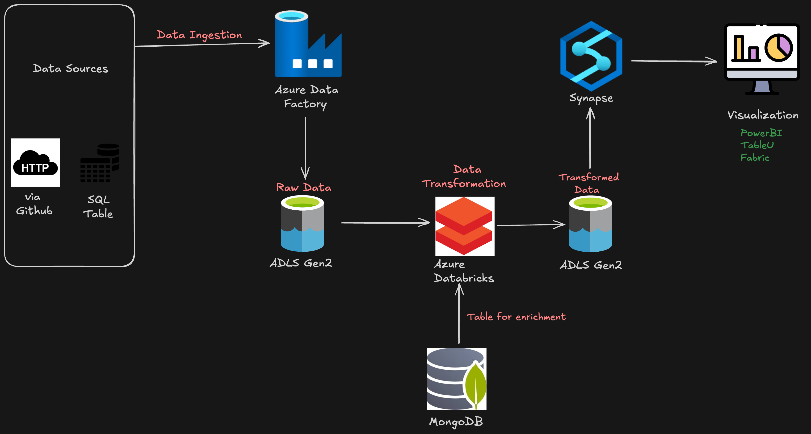
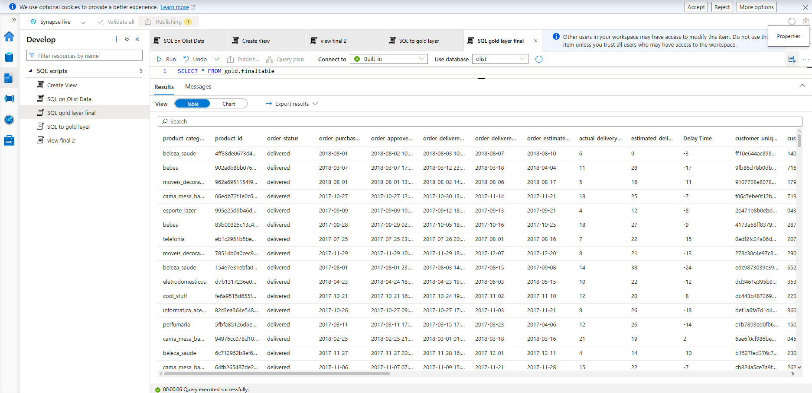

# 🛒 Olist Brazilian E-Commerce — Azure End-to-End Data Engineering Pipeline

A production-style cloud data pipeline built on **Azure**, ingesting raw e-commerce data from multiple heterogeneous sources, transforming it with distributed compute, and serving a clean analytical dataset using a Medallion (Bronze → Silver → Gold) Lakehouse architecture.

---

## 📐 Architecture Overview

```
Data Sources                  Ingestion             Storage            Compute              Serving
─────────────────             ─────────             ───────            ───────              ───────
GitHub (REST/HTTP)  ──┐
                      ├──► Azure Data   ──► ADLS Gen2   ──► Azure        ──► ADLS Gen2
SQL Server          ──┘    Factory          (Bronze)        Databricks        (Silver)
(filess.io)                                                    ▲
                                                               │
                                                           MongoDB
                                                        (Enrichment)

                                                         Azure Synapse ──► ADLS Gen2 (Gold)
```



**Key Services Used:**
- **Azure Data Factory** — Orchestration & ingestion (Lookup + ForEach + Copy Data)
- **Azure Data Lake Storage Gen2** — Medallion Lakehouse (Bronze / Silver / Gold)
- **Azure Databricks** — PySpark-based data transformation & joining
- **MongoDB (filess.io)** — NoSQL enrichment source (product category translations)
- **Azure App Registration (Service Principal)** — Secure OAuth2 auth between Databricks and ADLS
- **Azure Synapse Analytics** — Gold layer serving / analytical query layer

---

## 📦 Dataset

**Source:** [Olist Brazilian E-Commerce Public Dataset](https://www.kaggle.com/datasets/olistbr/brazilian-ecommerce) — Kaggle

The dataset models a Brazilian marketplace with 8 relational tables:

| Table | Description |
|---|---|
| `olist_orders_dataset` | Core orders table — the central fact table |
| `olist_order_items_dataset` | Line items per order (product, seller, price) |
| `olist_order_payments_dataset` | Payment details per order |
| `olist_order_reviews_dataset` | Customer review scores and comments |
| `olist_customers_dataset` | Customer location and unique ID |
| `olist_sellers_dataset` | Seller location data |
| `olist_products_dataset` | Product metadata (category, dimensions, weight) |
| `olist_geolocation_dataset` | Zip code → lat/lng mapping |
| `product_category_name_translation` | Portuguese → English category names *(stored in MongoDB)* |

**Schema relationships:**


To demonstrate handling of **multiple data source types**, the datasets are split across:
- **GitHub (HTTP/REST API)** — 7 CSV files hosted directly in the repo, referenced via a `ForEachInput.json` lookup file
- **MySQL (filess.io hosted)** — 1 table (`olist_order_payments_dataset`) ingested via Python (`mysql-connector-python`) using Google Colab
- **MongoDB (filess.io hosted)** — 1 collection (`product_categories`) used for enrichment in Databricks

---

## 🔁 Pipeline Design — Azure Data Factory

The ADF pipeline uses a **dynamic, config-driven pattern** to avoid hardcoding file paths:

1. **Lookup Activity** reads `ForEachInput.json` from GitHub — a JSON array containing `csv_relative_url` and `file_name` for each dataset.
2. **ForEach Activity** iterates over the lookup output.
3. Inside each iteration, a **Copy Data Activity** pulls the CSV from GitHub via HTTP connector and writes it to `olistdata/bronze/` in ADLS Gen2.
4. A separate **Copy Data Activity** (outside the loop) ingests the payments table from the MySQL database hosted on filess.io. The payments data was first loaded into MySQL using a Python script run in **Google Colab** (`DataIngestionToSQL.ipynb`), which uses `mysql-connector-python` to batch-insert records from the CSV.

**`ForEachInput.json` (lookup config):**
```json
[
  { "csv_relative_url": "Data-Engineering-Project/refs/heads/main/Data/olist_customers_dataset.csv", "file_name": "olist_customers_dataset.csv" },
  { "csv_relative_url": "Data-Engineering-Project/refs/heads/main/Data/olist_orders_dataset.csv",    "file_name": "olist_orders_dataset.csv" },
  ...
]
```

This pattern makes the pipeline **extensible** — adding a new dataset only requires updating the JSON file, not the pipeline itself.

---

## 🥉 Bronze Layer — Raw Ingestion

All 8 source files land in `olistdata/bronze/` as raw CSVs exactly as received from the sources — no transformation applied.

```
olistdata/
└── bronze/
    ├── olist_customers_dataset.csv
    ├── olist_geolocation_dataset.csv
    ├── olist_order_items_dataset.csv
    ├── olist_order_payments_dataset.csv
    ├── olist_order_reviews_dataset.csv
    ├── olist_orders_dataset.csv
    ├── olist_products_dataset.csv
    └── olist_sellers_dataset.csv
```

---

## 🥈 Silver Layer — Transformation (Azure Databricks)

Databricks connects to ADLS Gen2 using **OAuth2 via Service Principal** (App Registration), avoiding storage access keys.

```python
spark.conf.set(f"fs.azure.account.auth.type.{storage_account}.dfs.core.windows.net", "OAuth")
spark.conf.set(f"fs.azure.account.oauth.provider.type...", "ClientCredsTokenProvider")
spark.conf.set(f"fs.azure.account.oauth2.client.id...", application_id)
spark.conf.set(f"fs.azure.account.oauth2.client.secret...", client_secret)
```

### Transformations Applied

**1. Data Cleaning (all DataFrames)**
```python
def clean_dataframe(df, name):
    return df.dropDuplicates().na.drop('all')
```

**2. Date Parsing & Feature Engineering (orders)**
```python
orders_df = orders_df \
    .withColumn("order_purchase_timestamp",      to_date(col("order_purchase_timestamp"))) \
    .withColumn("order_delivered_customer_date", to_date(col("order_delivered_customer_date"))) \
    .withColumn("order_estimated_delivery_date", to_date(col("order_estimated_delivery_date"))) \
    .withColumn("actual_delivery_time",    datediff("order_delivered_customer_date", "order_purchase_timestamp")) \
    .withColumn("estimated_delivery_time", datediff("order_estimated_delivery_date", "order_purchase_timestamp")) \
    .withColumn("Delay Time", col("actual_delivery_time") - col("estimated_delivery_time"))
```

**3. Multi-table Join (star schema flattening)**
```python
orders_customers_df      = orders_df.join(customers_df, "customer_id", "left")
orders_payments_df       = orders_customers_df.join(payments_df, "order_id", "left")
orders_items_df          = orders_payments_df.join(items_df, "order_id", "left")
orders_items_products_df = orders_items_df.join(products_df, "product_id", "left")
final_df                 = orders_items_products_df.join(sellers_df, "seller_id", "left")
```

**4. MongoDB Enrichment (product category translations)**

Product category names in the source data are in Portuguese. The English translation table was loaded into MongoDB and pulled at transformation time:

```python
from pymongo import MongoClient
client     = MongoClient(uri)
mongo_data = pd.DataFrame(list(client[database]['product_categories'].find()))
mongo_spark_df = spark.createDataFrame(mongo_data.drop('_id', axis=1))

final_df = final_df.join(mongo_spark_df, "product_category_name", "left")
```

**5. Duplicate Column Removal**
```python
def remove_duplicate_columns(df):
    seen, to_drop = set(), []
    for col in df.columns:
        (to_drop if col in seen else seen).add(col)
    return df.drop(*to_drop)
```

**6. Write to Silver (Parquet / Snappy)**
```python
final_df.write.mode("overwrite").parquet(
    "abfss://olistdata@oliststorageacc.dfs.core.windows.net/silver/"
)
```

Silver output: 4 Parquet part files (~12 MiB total, Snappy compressed).

---

## 🥇 Gold Layer — Azure Synapse Analytics

The Silver Parquet data is read into **Azure Synapse Analytics** using `OPENROWSET`, where views and external tables are created for serving. The Gold layer stores the final analytical output as Parquet files in `olistdata/gold/Serving/`, ready for BI tools (Power BI, Tableau, Fabric).

### Synapse SQL Scripts

**1. Query Silver directly via OPENROWSET**
```sql
SELECT TOP 100 *
FROM OPENROWSET(
    BULK 'https://oliststorageacc.dfs.core.windows.net/olistdata/silver/',
    FORMAT = 'PARQUET'
) AS result
```

**2. Create a Gold schema view (all delivered orders)**
```sql
CREATE VIEW gold.final2 AS
SELECT *
FROM OPENROWSET(
    BULK 'https://oliststorageacc.dfs.core.windows.net/olistdata/silver/',
    FORMAT = 'PARQUET'
) AS result2
WHERE order_status = 'delivered'
```

**3. Export to Gold layer as an External Table (Parquet / Snappy)**
```sql
CREATE MASTER KEY ENCRYPTION BY PASSWORD = '...';
CREATE DATABASE SCOPED CREDENTIAL alanadmin WITH IDENTITY = 'Managed Identity';

CREATE EXTERNAL FILE FORMAT extfileformat WITH (
    FORMAT_TYPE = PARQUET,
    DATA_COMPRESSION = 'org.apache.hadoop.io.compress.SnappyCodec'
);

CREATE EXTERNAL DATA SOURCE goldlayer WITH (
    LOCATION = 'https://oliststorageacc.dfs.core.windows.net/olistdata/gold/',
    CREDENTIAL = alanadmin
);

CREATE EXTERNAL TABLE gold.finaltable WITH (
    LOCATION = 'Serving',
    DATA_SOURCE = goldlayer,
    FILE_FORMAT = extfileformat
) AS SELECT * FROM gold.final2;
```



```
olistdata/
└── gold/
    └── Serving/
        ├── EFA767A6-..._13_0-3.parquet
        ├── EFA767A6-..._13_0-5.parquet
        ├── EFA767A6-..._13_0-8.parquet
        └── EFA767A6-..._13_0-10.parquet
```

---

## 🔐 Security & Authentication

| Connection | Method |
|---|---|
| Databricks → ADLS Gen2 | OAuth2 via Azure App Registration (Service Principal) |
| ADF → GitHub | HTTP REST connector (anonymous, public repo) |
| Google Colab → MySQL | Python `mysql-connector-python` with credentials (filess.io hosted MySQL) |
| Databricks → MongoDB | PyMongo connection string (filess.io hosted MongoDB) |

---

## 🗂️ Repository Structure

```
Data-Engineering-Project/
├── Data/
│   ├── olist_customers_dataset.csv
│   ├── olist_geolocation_dataset.csv
│   ├── olist_order_items_dataset.csv
│   ├── olist_order_reviews_dataset.csv
│   ├── olist_orders_dataset.csv
│   ├── olist_products_dataset.csv
│   └── olist_sellers_dataset.csv
├── ForEachInput.json                       ← ADF Lookup config
├── Databricks_Code_for_Transformation.ipynb
├── DataIngestionToSQL.ipynb                ← Google Colab: loads payments CSV → MySQL
└── README.md
```

---

## 🛠️ Tech Stack

| Layer | Technology |
|---|---|
| Orchestration | Azure Data Factory |
| Storage | Azure Data Lake Storage Gen2 |
| Compute | Azure Databricks (PySpark) |
| Enrichment | MongoDB (PyMongo) |
| Serving | Azure Synapse Analytics |
| Source Control | GitHub |
| Language | Python / PySpark |
| File Formats | CSV (Bronze) → Parquet/Snappy (Silver & Gold) |

---

## 🚀 How to Reproduce

1. Fork this repo and upload the datasets to the `Data/` folder (download from [Kaggle](https://www.kaggle.com/datasets/olistbr/brazilian-ecommerce)).
2. Create an ADLS Gen2 storage account with a container named `olistdata` and sub-folders `bronze`, `silver`, `gold`.
3. Register an Azure App (Service Principal) and grant it **Storage Blob Data Contributor** on the storage account.
4. In Azure Data Factory, create a pipeline with a **Lookup** (pointing to `ForEachInput.json`) → **ForEach** → **Copy Data** pattern.
5. Spin up an Azure Databricks cluster, create a notebook, and run the transformation code (update credentials as environment variables or Databricks secrets).
6. Connect Azure Synapse to the Silver layer and run your serving queries to populate the Gold layer.

---

## 📊 Dataset Credit

Olist Brazilian E-Commerce dataset by [Olist](https://olist.com/) on [Kaggle](https://www.kaggle.com/datasets/olistbr/brazilian-ecommerce), licensed under CC BY-NC-SA 4.0.
